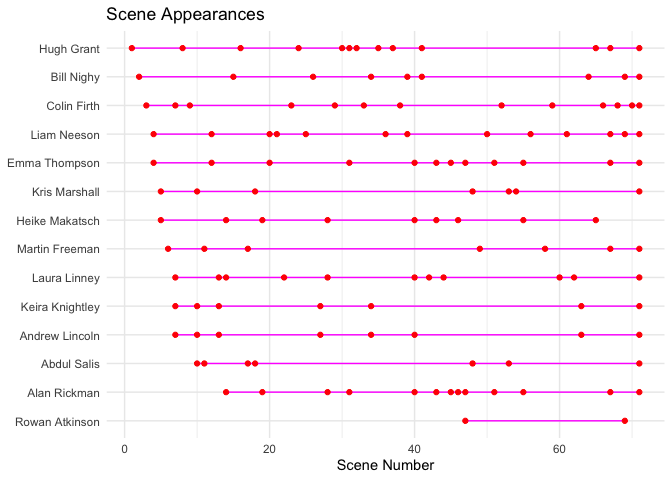
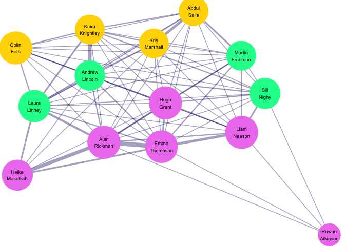

# README

## Data

*Love Actually* (2003) is an ensemble romantic comedy set in London
during the month leading up to Christmas. The film weaves together nine
loosely interconnected love stories, each examining a different facet of
love – the one emotion common to all people. Because the film is
structured as a set of parallel narratives connected by points of
intersection, its character relationships are well represented as a
network, motivating my network analysis approach in this project.

I downloaded two CSV files from GitHub and then tidied the data in R for
my analysis:

- [**`appearances`**](https://github.com/fivethirtyeight/data/blob/master/love-actually/love_actually_appearances.csv)
  was originally a table indicating which characters appear in each of
  the scenes, plus a short description of each scene. Using
  `pivot_longer()`, I tidied the data into a long-format table with one
  (actor, scene) pair per row, included a `scene_number` column to give
  each scene a unique ID number, and added `appearances`: a binary
  indicator variable which is 1 if the character made an appearance in a
  given scene, and 0 otherwise.

- [**`adjacencies`**](https://github.com/fivethirtyeight/data/blob/master/love-actually/love_actually_adjacencies.csv)
  is a 14 × 14 co-appearance matrix. The diagonal entries store each
  character’s total scene count and the off-diagonal entries form the
  edge weights of the character network. From the adjacency matrix I
  derived two data frames: `nodes` (one per character, weighted by total
  scenes) and `edges` (one per character pair who share a scene,
  weighted by count).

## Questions

My project focuses on two related questions:

- *Scene Appearances*: When does each character appear across the 71
  scenes of which the film is comprised, and what does the rythm of
  their screen time look like?

- *Character Networks*: Which characters share scenes with which others,
  and do those co-appearances cluster into the distinct storylines the
  film is built around?

## Visualizations

### Scene Appearances

### Character Networks

